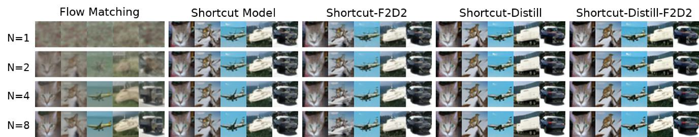

# Joint Distillation for Fast Likelihood Evaluation and Sampling in Flow-based Models

<!-- [Paper](https://arxiv.org/abs/2512.02636) -->

The implementation for [Joint Distillation for Fast Likelihood Evaluation and Sampling in Flow-based Models](https://arxiv.org/abs/2512.02636).



## Environment
Run the following command to set up the Python environment through `conda`.

```
conda env create -f f2d2_env.yml
```

## Datasets
Prepare the CIFAR10 dataset in the same way as [EDM](https://github.com/NVlabs/edm?tab=readme-ov-file#preparing-datasets).

## Training
1. Train a teacher Flow Matching model. Remember to set the variables in `run_fm.sh`.
```
run_fm.sh <NGPUs> <PORT>
```

2. Use the teacher Flow Matching model to train a Shortcut-Distill model. Remember to set the variables in `run_sc.sh`.
```
run_sc.sh <NGPUs> <PORT> 
```
3. Resume the Shortcut-Distill model to train a Shortcut-Distill-F2D2 model. Remember to set the variables in `run_ll.sh`.

```
run_ll.sh <NGPUs> <PORT> 
```

## Evaluation
Load checkpoints and evaluate the negative loglikelihood.
```
python nll.py \
  --test_batch_path <TEST_BATCH_PATH> \
  --model_pkl <MODEL_PATH> \
  --batch_size 128 \
  --time_eval_steps 8
```

## References
This repo is based on:
- [EDM](https://github.com/NVlabs/edm)
- [ECT](https://github.com/locuslab/ect)
- [Flow Matching](https://github.com/facebookresearch/flow_matching)
- [Consistency Model](https://github.com/openai/consistency_models)
- [CTM](https://github.com/sony/ctm)
- [Meanflow](https://github.com/Gsunshine/py-meanflow)

We would like to express our appreciation to them.

## Citation

```
@article{ai2025joint,
  title={Joint Distillation for Fast Likelihood Evaluation and Sampling in Flow-based Models},
  author={Ai, Xinyue and He, Yutong and Gu, Albert and Salakhutdinov, Ruslan and Kolter, J Zico and Boffi, Nicholas Matthew and Simchowitz, Max},
  journal={arXiv preprint arXiv:2512.02636},
  year={2025}
}
```
